Installing Caché
=================

Authors: Joseph Snyder, Sam Habiel

License: 

.. image:: https://i.creativecommons.org/l/by/4.0/80x15.png 
   :target: http://creativecommons.org/licenses/by/4.0/ 

The following instructions were adapted from Nancy Anthracite\'s document entitled `InstallingVistAWithSingleUserVersionCache5.2`_, which was created to guide a user through installing InterSystems Caché onto a Windows operating system. The instructions were using an older version of Caché; this uses the Caché 2015 version and shows the updated Management Portal interface.

.. _`InstallingVistAWithSingleUserVersionCache5.2`:
   http://opensourcevista.net:8888/NancysVistAServer/InstallingVistAWithSingleUserVersionCache5.2.doc

Trial versions of the Caché installer can be downloaded from

    http://download.intersystems.com/download/register.csp.

This installation guide uses Caché 2011.1, it should also apply for Cache 2013 to 2016. If you already have a Caché installation and are looking to install VistA as an additional database, you do not have to re-install Caché. Please use your existing installation and pick up the instructions at the point where the folder is created within the mgr folder.

Download and Install Caché on Microsoft Windows
-----------------------------------------------
Download the Caché installer from the above link and double click on the downloaded .exe file. The first window that requires interaction is the Licensing Agreement shown in the figure below. Agree to the license in order to continue in the installation process.

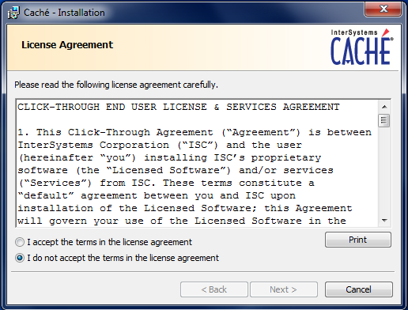

The next window asks to set the directory in which Caché will be installed. Most users will be able to accept the default path. If more than one instance is found on the machine, subsequent instances will be denoted with a number appended to the end of the instance name.

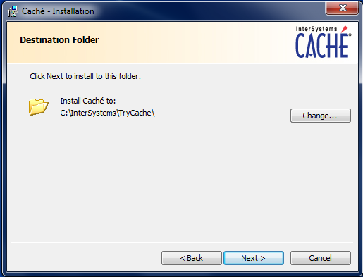

If you are installing the production version of Caché, a series of dialogs will be presented as shown in the following figures.

Instance Name: you can have multiple instances of Caché on your machine; each instance can hold several namespaces.

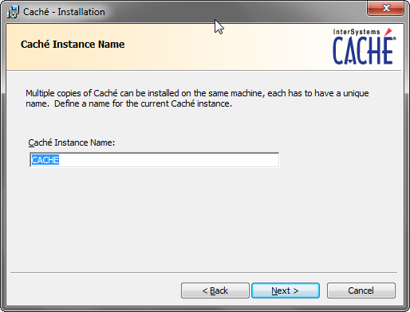

Setup Type: allows you to install different components.

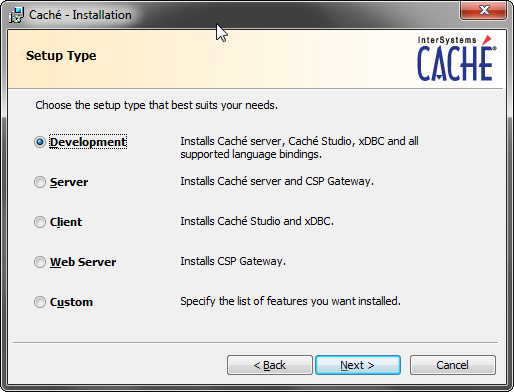

Install unicode Support: the Unicode version of Caché is not needed for VistA implementation. As most CACHE.DATs in the United States
are distributed in ASCII mode and there is no way to switch between the ASCII vs Unicode versions of Caché, and you should install the ASCII version. (GT.M, however, allows dynamic switching between ASCII and UTF-8 mode.)

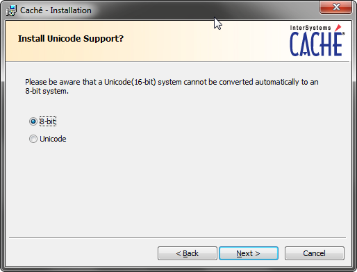

Initial Security Settings: defines starting security settings. If you are just trying VistA, you should choose the least secure settings.

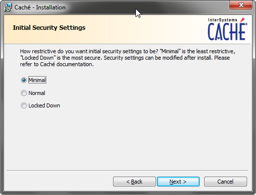

Ready to Install: once the install directory is set, the installer will display a summary of the instance that will be installed in the process. You may enter a license if you have one, but this is not a required step for the current testing configuration.

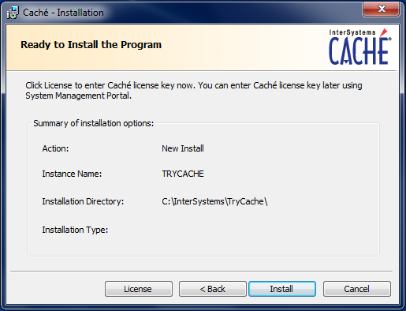

After a successful installation, the completion screen is shown.

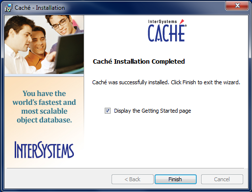

The first sign of a correctly installed and running instance of Caché is the
Caché Cube in the taskbar, like below.

.. figure::
   images/InstallCache/Cube.png
   :align: center
   :alt:  Screenshot of Caché Cube in taskbar.

Clicking on the Cube will open a menu that displays the options to interact with the Caché database.

.. figure::
   images/InstallCache/MenuDoc.png
   :align: center
   :alt:  The main menu that shows when the Caché Cube is clicked.

The next test to ensure that your Caché instance is working is to open the documentation. This will bring up the documentation home page in your default web browser.

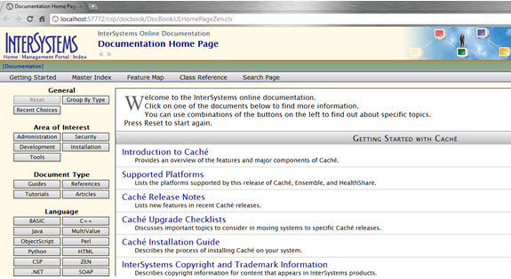

Download and Install Caché on macOS X or Linux
----------------------------------------------
On macOS X, a graphical installer is used to download a .dmg, open it, and then run the .pkg file. Linux uses a text based installer. In either case, you should follow the instructions found on Intersystems' website.

Configuring Caché
------------------

Once Caché is installed, create the proper folders and environment to run the VistA instance within Caché. First, go to the mgr folder of Caché and create a new folder as shown below. This folder will hold the database file cache.dat that will contain the VistA routines and globals and can be anywhere on your system; it doesn't have to be with the other databases Caché supplies. 

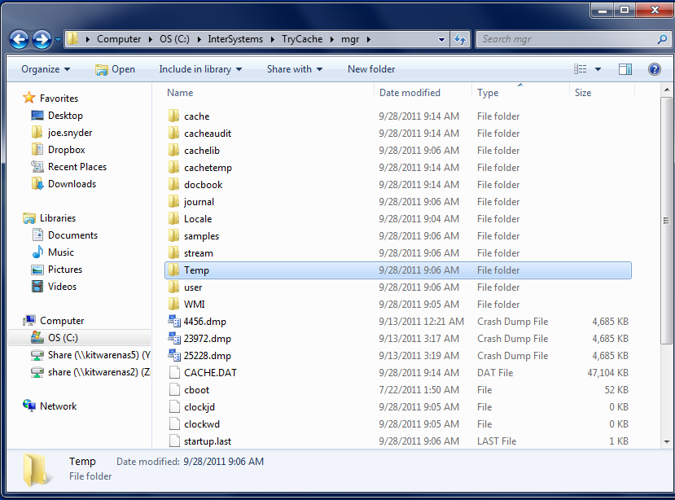

In this example, the folder has been given the name \"VistA.\" 

.. figure::
   images/InstallCache/MgrFldrVistA.png
   :align: center
   :alt:  mgr folder post-creation of VistA folder

Now we are ready to stand up the VistA instance. On Windows, right click on the Caché cube and select Management Portal of Caché. On macOS and Linux, the URL is http://localhost:57772/csp/sys/UtilHome.csp.

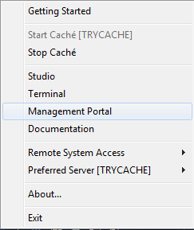

When the Management Portal web pageopens, click on System Administration to show administrative options.

.. figure::
   images/InstallCache/SysMgtMain.png
   :align: center
   :alt:  Main page of the Management Portal

System Administration shows those options that can be used to change the Caché system. Our goal is to use the Configuration function to create and initialize an empty database that can then be filled with the VistA routines and globals. Starting from |sysadmin|:

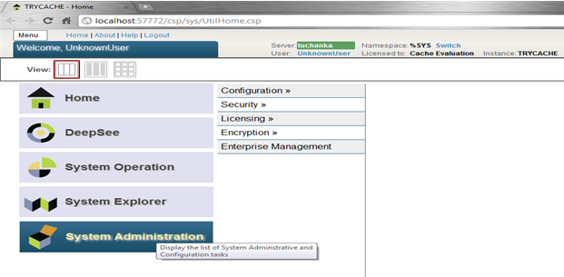

.. |sysadmin| replace:: System Administration page of Management Portal

Click on Configuration, System Configuration, and Local Databases to arrive at |adminmenu|. Create the database by clicking on the Local Databases tab and then selecting Go.

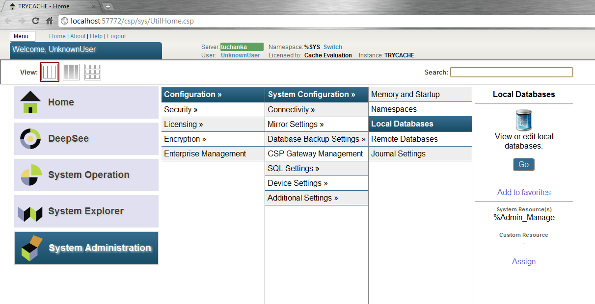

.. |adminmenu| replace:: System Configuration menu

The resulting page contains a list of all of the local databases, all of which were created automatically during the installation of Caché. Create a new database by clicking on the \"Create New Database\" button to bring up a wizard.

.. figure::
   images/InstallCache/CreateDatabase.png
   :align: center
   :alt:  Local Databases page with pointer to Create New Database button.

Set the directory entry to the folder that you created during the installation procedure and set the database name. We recommend using the same name as the folder, but this is not required. When satisfied, select \"Next\" to proceed.

.. figure::
   images/InstallCache/DatabaseWizardName.png
   :align: center
   :alt:  First page of the Database Wizard.

For a test installation, we recommend simply hitting Finish to proceed, accepting the default settings. However, if there are known, required settings for the current site, these settings can be modified.

.. figure::
   images/InstallCache/DatabaseWizardDetails.png
   :align: center
   :alt:  Details of the Database Wizard

Verify that the newly created database appears in the database listing.

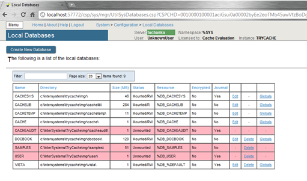

We now will configure the namespace for the newly created database. Navigate back to the System Configuration menu and click on the Namespaces option.

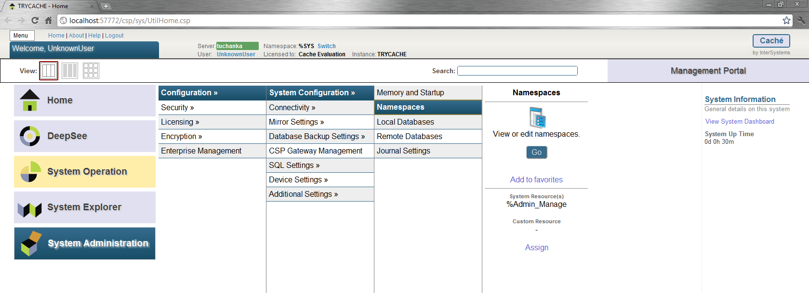

Then click the \"Create New Namespace\" button to open a wizard.

.. figure::
   images/InstallCache/CreateNewNamespace.png
   :align: center
   :alt:  Namespace listing and button to create a new namespace.

In the wizard, enter the name of the namespace and select the database created above. Be certain to name the Namespace the same as the folder created above. Click on \"Save\" to finish the Namespace creation and to return to the namespace listing.

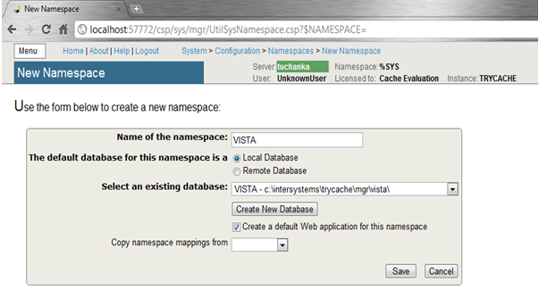

Verify that the new namespace is now in the list of current namespaces.

The next steps are to configure the global and routine mappings, both of which are accessed from this page. We will focus on the global mapping first.

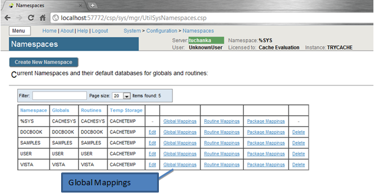
          The boxes highlight the links for mapping globals and routines.

To create the new mapping, click on New Global Mapping.  This opens another configuration wizard.

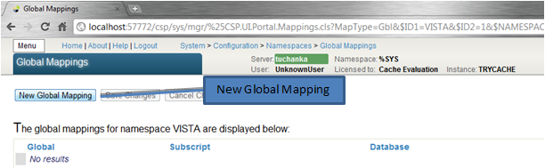

First, set the Global Database location to the VistA database name, and for the Global Name enter \"%Z*\". This will map all globals that start with \"%Z\" to be specific to the VistA namespace. Click OK and the wizard will exit and display the new mapping in the window. Repeat this for %ut and %Serenj*

In order to speed the performance of any temporary globals, which are very frequently used, map the following Global Names to global database location, CACHETEMP:

+---------+
| HLTMP   |
|         |
| TMP     |
|         |
| UTILITY |
|         |
| XTMP    |
|         |
| XUTL    |
+---------+

Be sure to click on Save Changes before navigating back to the Namespaces page. This is what you will see. (Your database name may differ.)

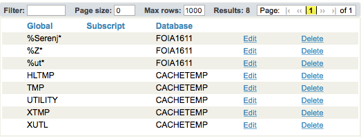

The final step before Caché is ready for the import is to map the routines. From within the Namespaces menu in the Management Portal, click on the Routine Mappings link.

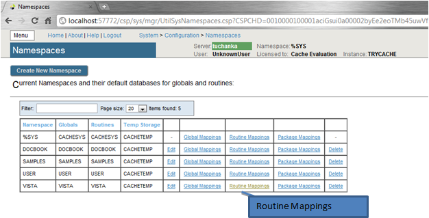

This page will list the current routine mappings for the VistA namespace. As with the globals, there are no initial mappings. Click on the New Routine Mapping button to bring up the routine mapping wizard.

.. figure::
   images/InstallCache/NewRoutineMapping.png
   :align: center
   :alt:  Adding new Routine Mappings.

Select the database location that corresponds to the VistA database, enter \"%DT\" into the Routine name, and click Apply to add the first namespace mapping to the VistA database.

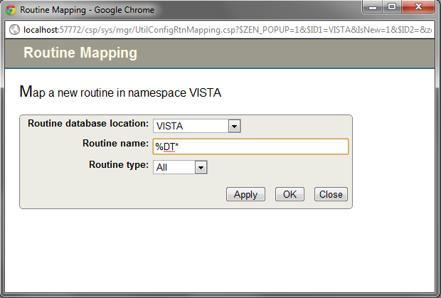

Repeat the procedure with the following eight (8) mappings:
+-------+
| %DTC  |
|       |
| %RCR  |
|       |
| %XUCI |
|       |
| %Z*   |
|       |
| %     |
|       |
| %KIDS |
|       |
| %ut*  |
|       |
| %Serenj* |
+-------+

After the final mapping is set, click OK to be sent back to the Routine Mapping page. The nine mappings should now be listed on the page. Click on the Save Changes button to complete the step.

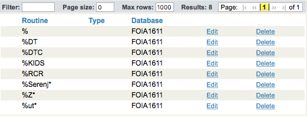

The final step of preparing the Caché installation for testing, if you have a licensed version, is to set the instance to allow TELNET service. The evaluation version of Cache won't let you do this. This is done though the System Administration > Security > Services menu.

.. figure::
   images/InstallCache/ServicesMenu.png
   :align: center
   :alt:  Menu path to the Services option.

Click on Go to be brought to the menu which lists all services that are supported by Caché. Near the bottom of the list you will see the \"%Service_Telnet\" listing.

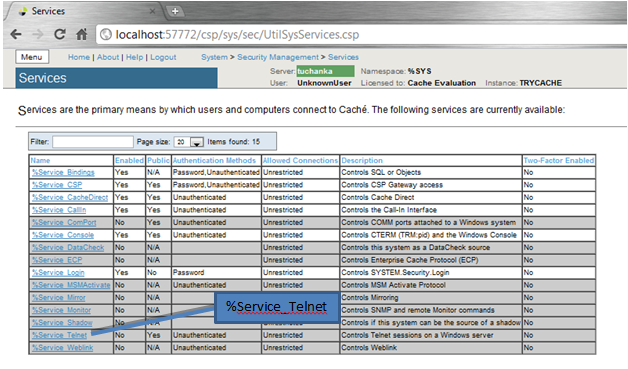

Click on the link to bring up the \"Edit Service\" page.

To enable the Telnet session, simply check the box next to \"Service Enabled\" and then click \"Save\".

.. figure::
   images/InstallCache/EnableTelnetService.png
   :align: center
   :alt:  Enabling the Telenet service.

After saving, the Services menu will now show that the Telnet service is enabled.

.. figure::
   images/InstallCache/TelnetServiceEnabled.png
   :align: center
   :alt:  Services menu with Telnet enabled

Install CACHE.DAT
-----------------

Download the CACHE.DAT from http://foia-vista.osehra.org/DBA_VistA_FOIA_System_Files/. 

The first step in installing the CACHE.DAT is to stop the Caché instance so that the instance will not clobber a process during the copy.

In Windows, right click on the Caché Cube in the taskbar.

.. figure:: images/InstallCache/Cube.png
   :align: center
   :alt:  Screenshot of Caché Cube in taskbar.

Select \"Stop Caché\" to pop up a window for confirmation.

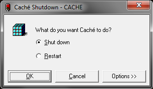

Select "Shut down" and click \"OK\". A status window will appear while the shutdown is happening.

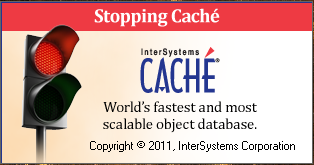

  The status window disappears and the taskbar Caché Cube is grayed out when the instance is down.

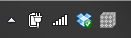

On macOS and Linux, you should run ``ccontrol list`` to find your instance name, and then ``ccontrol stop <instance name>``.

At this point, you can take your downloaded CACHE.DAT and copy it into the directory that has been set up in Caché for VistA. If you followed the above, it will be \"C:/Intersystems/TryCache/mgr/VistA\". Your directory will differ for macOS and Linux.

All that is left is to restart the Caché instance.

For Windows, right-click on the grayed-out Caché Cube and click \"Start Caché\". A status window will pop up to signify the instance is starting up.

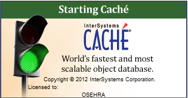

When it disappears and the Caché Cube is blue, the instance is ready for use again.

On macOS and Linux, run ``ccontrol start <instance name>`` to start it back up.

At this point, you are ready to continue to `Initialize Vista
<./InitializeVistA.html>`_.
